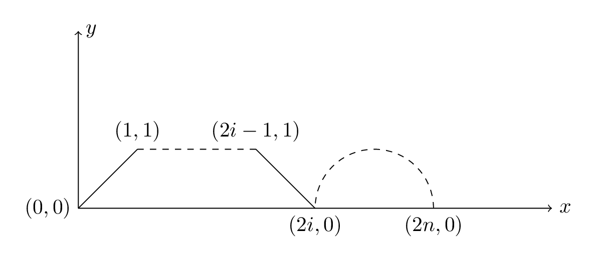
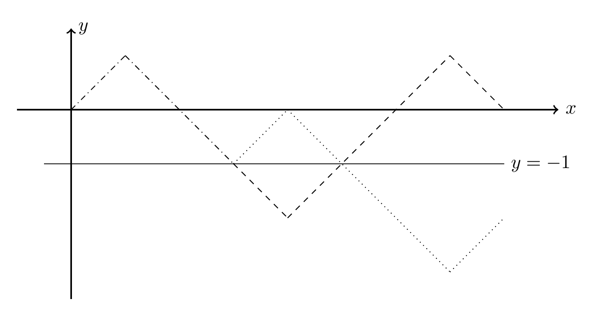

设 $0!=0^0=1$。

施工中。有部分空缺。

## 加法 & 乘法原理

### 加法原理

完成一个任务有 $n$ 类办法，第 $i$ 类办法有 $a_i$ 个方法，则完成该任务共有 $\sum_{i=1}^{n}a_i$ 种不同的方法。

### 乘法原理

完成一个任务有 $n$ 个步骤，第 $i$ 个步骤有 $a_i$ 个方法，则完成该任务共有 $\prod_{i=1}^{n}a_i$ 种不同的方法。

## 排列 & 组合数

### 排列数

从 $n$ 个互不相同的元素中取出 $m$（$m\le n$，$m,n\in\Bbb{N}$）个并按照一定的顺序排列，所得到的排列称为 **$n$ 中取 $m$ 的一个排列**。设完成这个任务的方案数（也是所得排列的个数）为 $\mathrm{A}_n^m$，有计算 $\mathrm{A}_n^m$ 的公式

$$
\mathrm{A}_n^m=n\times (n-1)\times\cdots\times (n-(m-1))=\prod_{i=1}^{m}(n-(i-1))=\cfrac{n!}{(n-m)!}\tag{1}
$$

$(1)$ 可以用乘法原理解释。上述任务共分 $m$ 步，其中第 $i$ 步执行“从剩余 $(n-(i-1))$ 个元素中取出 $1$ 个”，显然第 $i$ 步有 $(n-i+1)$ 个方案，于是累乘。

### 组合数

从 $n$ 个互不相同的元素中取出 $m$（$m\le n$，$m,n\in\Bbb{N}$）个组成集合，所得到的集合称为 **$n$ 中取 $m$ 的一个组合**，设所得的组合个数（重复的不计）为 $\mathrm{C}_n^m=\dbinom{n}{m}$。

显然的，对于每个组合 $C$，都可以得出 $m!$ 个以 $C$ 内元素组成的排列。（只需将 $C$ 内 $m$ 个元素全排列即可。）于是，

$$
m!\dbinom{n}{m}=\mathrm{A}_n^m
$$

于是有计算 $\dbinom{n}{m}$ 的公式

$$
\dbinom{n}{m}=\cfrac{\mathrm{A}_n^m}{m!}=\cfrac{n!}{(n-m)!m!}\tag{2}
$$

在 OI 中，由于 $m>n$ 的情况对于定义无意义，故设此时 $\mathrm{A}_n^m=\dbinom{n}{m}=0$，代表无方案。（一般地，无意义的情况组合、排列数均默认为 $0$。）

### 圆排列

### 多重组合数

### 杨辉三角

容易通过下面将要介绍的 $(3)$ 式得到杨辉三角 $\iff$ 组合数。

这里给出一个表格

$$
\text{The table of }\dbinom{n}{m}\\
\begin{array}{|r|c|c|c|c|c|c|c|c|c|c|}\hline
	n\backslash m&\bold{0}&\bold{1}&\bold{2}&\bold{3}&\bold{4}&\bold{5}&\bold{6}&\bold{7}&\bold{8}&\bold{9}\\\hline
	\bold{0}&1\\\hline
	\bold{1}&1&1\\\hline
	\bold{2}&1&2&1\\\hline
	\bold{3}&1&3&3&1\\\hline
	\bold{4}&1&4&6&4&1\\\hline
	\bold{5}&1&5&10&10&5&1\\\hline
	\bold{6}&1&6&15&20&15&6&1\\\hline
	\bold{7}&1&7&21&35&35&21&7&1\\\hline
	\bold{8}&1&8&28&56&70&56&28&8&1\\\hline
	\bold{9}&1&9&36&84&126&126&84&36&9&1\\\hline
\end{array}
$$

将组合数操作转化到为杨辉三角上研究是一个常用方法。下面的性质也可以结合杨辉三角理解（下面的部分可能偏形式化）。

## 组合数常见性质（公式）

~~方便起见，以下 $\sout{k\in\Bbb{N},k\le n}$。~~

### 对称公式

$$
\dbinom{n}{k}=\dbinom{n}{n-k}\tag{3}
$$

即对换取与不取（$C\leftrightarrows \complement_{\{1,\cdots,n\}} C$）。

### 加法公式（递推式）

$$
\dbinom{n}{k}=\dbinom{n-1}{k}+\dbinom{n-1}{k-1}\tag{4}
$$

可视为最后一个元素取与不取之和。不取则从 $n-1$ 中选 $k$，取则从 $n-1$ 中选 $k-1$。

### 吸收公式

$$
\dbinom{n}{k}=\cfrac{n}{k}\dbinom{n-1}{k-1}\tag{5}
$$

由通项公式 $(2)$ 可得：

$$
\dbinom{n}{k}=\cfrac{n!}{(n-k)!k!}=\cfrac{n\times(n-1)!}{k\times(n-k)!(k-1)!}=\cfrac{n}{k}\dbinom{n-1}{k-1}
$$

### 二次选择

$$
\dbinom{n}{m}\dbinom{m}{k}=\dbinom{n}{k}\dbinom{n-k}{m-k}\tag{6}
$$

设 $|A|=n,|B|=m,|C|=k,C\subseteq B\subseteq A$，则

从 $A$ 中选出 $B$，再从 $B$ 中选出 $C$ 的方案数 等于 先从 $A$ 中选出 $C$，然后从 $\complement_A C$ 中选出 $B'$，则 $B=B'\cup C$ 的方案数。

换个角度，使用定义，

$$
\begin{aligned}
	\dbinom{n}{m}\dbinom{m}{k}&=\cfrac{n!}{(n-m)!m!}\times\cfrac{m!}{(m-k)!k!}\\
	&=\cfrac{n!}{(n-m)!}\times\cfrac{1}{(m-k)!k!}\\
	&=\cfrac{n!}{k!}\times\cfrac{1}{(m-k)!(n-m)!}\\
	&=\cfrac{n!}{(n-k)!k!}\times\cfrac{(n-k)!}{(m-k)!(n-m)!}\\
	&=\dbinom{n}{k}\dbinom{n-k}{m-k}
\end{aligned}
$$

### 行求和

$$
\sum_{i=0}^{n}\dbinom{n}{i}=2^n\tag{7}
$$

即所有选择的方案数等于所有长度为 $i$ 的方案数之和（$0\le i\le n$）。

换个角度，由 $(4)$ 得

$$
\sum_{i=0}^{n}\dbinom{n}{i}=\sum_{i=0}^{n}\left[\dbinom{n-1}{i-1}+\dbinom{n-1}{i}\right]=\sum_{i=-1}^{n-1}\dbinom{n-1}{i}+\sum_{i=0}^{n}\dbinom{n-1}{i}=2\sum_{i=0}^{n-1}\dbinom{n-1}{i}
$$

即行求和等于上一行求和的两倍。$n=0$ 时，

$$
\sum_{i=0}^{n}\dbinom{n}{i}=\dbinom{0}{0}=1=2^0=2^n
$$

故运用数学归纳法可得式 $(7)$。

其实 $(7)$ 式可由二项式定理代入 $a=1,b=1$ 得到。下文会介绍。

### 带符号行求和

$$
\sum_{i=0}^{n}(-1)^i\dbinom{n}{i}=[n=0]\tag{8}
$$

同样由 $(4)$ 得（$n\ne 0$ 时）

$$
\sum_{i=0}^{n}(-1)^i\dbinom{n}{i}=\sum_{i=0}^{n}(-1)^i\left[\dbinom{n-1}{i-1}+\dbinom{n-1}{i}\right]=\dbinom{n-1}{-1}+\dbinom{n-1}{n}=0
$$

上面的推导运用了类似裂项的技巧，前后两项可以消去，只剩头尾。当 $n=0$ 时，

$$
\sum_{i=0}^{n}(-1)^i\dbinom{n}{i}=(-1)^0\times\dbinom{0}{0}=1
$$

综上可得 $(8)$。同样，其可由二项式定理代入 $a=1,b=-1$ 得到。

### 带权行求和

$$
\sum_{i=0}^{n}i\dbinom{n}{i}=n2^{n-1}\tag{9}
$$

$$
\sum_{i=0}^{n}i^2\dbinom{n}{i}=n(n+1)2^{n-1}\tag{10}
$$

### 列求和

$$
\sum_{i=k}^{n}\dbinom{i}{k}=\dbinom{n+1}{k+1}\tag{11}
$$

考虑 $\dbinom{k}{k}=\dbinom{k+1}{k+1}=1$，

$$
\begin{aligned}
	\sum_{i=k}^{n}\dbinom{i}{k}&=\dbinom{k}{k}+\sum_{i=k+1}^{n}\dbinom{i}{k}\\
	&=\dbinom{k+1}{k+1}+\sum_{i=k+1}^{n}\dbinom{i}{k}\\
	&=\dbinom{k+1}{k+1}+\dbinom{k+1}{k}+\sum_{i=k+2}^{n}\dbinom{i}{k}\\
	&=\dbinom{k+2}{k+1}+\sum_{i=k+2}^{n}\dbinom{i}{k}\\
	&\quad\vdots\\
	&=\dbinom{k+j-1}{k+1}+\sum_{i=k+j-1}^{n}\dbinom{i}{k}\\
	&=\dbinom{k+j-1}{k+1}+\dbinom{k+j-1}{k}+\sum_{i=k+j}^{n}\dbinom{i}{k}\\
	&=\dbinom{k+j}{k+1}+\sum_{i=k+j}^{n}\dbinom{i}{k}\\
	&\quad\vdots\\
	&=\dbinom{k+(n-k+1)}{k+1}+\sum_{\mathclap{i=k+(n-k+1)}}^{n}\dbinom{i}{k}\\
	&=\dbinom{n+1}{k+1}
\end{aligned}
$$

很吓人？其实就是一行行地向下迭代。

### 主对角线（方向）求和

$$
\sum_{i=0}^{k}\dbinom{n+i}{i}=\dbinom{n+k+1}{k}\tag{12}
$$

考虑 $\dbinom{n}{0}=\dbinom{n+1}{0}=1$，

$$
\begin{aligned}
	\sum_{i=0}^{k}\dbinom{n+i}{i}&=\dbinom{n}{0}+\sum_{i=1}^{k}\dbinom{n+i}{i}\\
	&=\dbinom{n+1}{0}+\sum_{i=1}^{k}\dbinom{n+i}{i}\\
	&=\dbinom{n+1}{0}+\dbinom{n+1}{1}+\sum_{i=2}^{k}\dbinom{n+i}{i}\\
	&=\dbinom{n+2}{1}+\sum_{i=2}^{k}\dbinom{n+i}{i}\\
	&\quad\vdots\\
	&=\dbinom{n+j}{j-1}+\sum_{i=j}^{k}\dbinom{n+i}{i}\\
	&\quad\vdots\\
	&=\dbinom{n+(k+1)}{(k+1)-1}+\sum_{i=k+1}^{k}\dbinom{n+i}{i}\\
	&=\dbinom{n+k+1}{k}
\end{aligned}
$$

### 辅对角线（方向）求和

$$
\sum_{i=0}^{\left\lfloor\frac{n}{2}\right\rfloor}\dbinom{n-i}{i}=F_{n+1}\tag{13}
$$

其实累加上界并不重要，即上界是比较松的，因为 $i>\left\lfloor\dfrac{n}{2}\right\rfloor$ 时 $n-i<i$，无意义。这里可以放大，视为 $n$，

$$
\begin{aligned}
	\sum_{i=0}^{n}\dbinom{n-i}{i}&=\sum_{i=0}^{n}\left[\dbinom{n-i-1}{i}+\dbinom{n-i-1}{i-1}\right]\\
	&=\sum_{i=0}^{n}\dbinom{n-i-1}{i}+\sum_{i=0}^{n}\dbinom{n-i-1}{i-1}\\
	&=\sum_{i=0}^{n}\dbinom{(n-1)-i}{i}+\sum_{i=0}^{n}\dbinom{(n-2)-(i-1)}{i-1}\\
	&=\sum_{i=0}^{n-1}\dbinom{(n-1)-i}{i}+\sum_{i=0}^{n-2}\dbinom{(n-2)-i}{i}\\
\end{aligned}
$$

注意到上式满足斐波那契数列的递推式，同时 $n=0$ 时式 $(11)$ 等于 $1$，$n=1$ 时式 $(13)$ 也等于 $1$，故式 $(13)$ 得证（数学归纳法）。

### 范德蒙德卷积

$$
\sum_{i=0}^k\binom{n}{i}\binom{m}{k-i}=\binom{n+m}{k}\tag{14}
$$

证明使用二项式定理（设 $l=i+j$）

$$
\begin{aligned}
	\sum_{k=0}^{n+m}\binom{n+m}{k}x^k&=(x+1)^{n+m}\\
	&=(x+1)^n(x+1)^m\\
	&=\left[\sum_{i=0}^n\binom{n}{i}x^i\right]\left[\sum_{j=0}^m\binom{m}{j}x^j\right]\\
	&=\sum_{i=0}^n\sum_{j=0}^m\binom{n}{i}\binom{m}{j}x^l\\
	&=\sum_{l=0}^{n+m}\sum_{i=0}^l\binom{n}{i}\binom{m}{k-i}x^l\\
	\sum_{k=0}^{n+m}{\color{blue}\binom{n+m}{k}}x^k&=\sum_{l=0}^{n+m}{\color{red}\sum_{i=0}^l\binom{n}{i}\binom{m}{k-i}}x^l\\
	\binom{n+m}{k}&=\sum_{i=0}^l\binom{n}{i}\binom{m}{k-i}\\
\end{aligned}
$$

换个角度，考虑其组合意义。设 $|S|=n,|T|=m$，$S,T$ 中的元素每个都相同。在大小 $n+m$ 的集合 $S\cup T$ 中取出 $k$ 个元素，等价于从 $S$ 中取 $i$ 个，$T$ 中取 $k-i$ 个，合并。取法二中，枚举 $i$ 累加所有方案数，即与取法一方案数相等。

而上述意义是更利于记忆的。

#### 推论 $1$

$$
\sum_{i=-a}^{b}\dbinom{n}{a+i}\dbinom{m}{b-i}=\dbinom{n+m}{a+b}\tag{15}
$$

证明类似。同样可以用形式化证明或组合意义。

#### 推论 $2$

$$
\sum_{i=1}^{n}\dbinom{n}{i}\dbinom{n}{i-1}=\dbinom{2n}{n-1}\tag{16}
$$

考虑转化为 $(14)$，

$$
\sum_{i=1}^{n}\dbinom{n}{i}\dbinom{n}{i-1}=\sum_{i=1}^{n}\dbinom{n}{n-i}\dbinom{n}{i-1}=\sum_{i=0}^{n-1}\dbinom{n}{n-1-i}\dbinom{n}{i}=\dbinom{2n}{n-1}
$$

#### 推论 $3$

$$
\sum_{i=0}^{n}\dbinom{n}{i}^2=\dbinom{2n}{n}\tag{17}
$$

依然转化，

$$
\sum_{i=0}^{n}\dbinom{n}{i}^2=\sum_{i=0}^{n}\dbinom{n}{i}\dbinom{n}{n-i}=\dbinom{2n}{n}
$$

#### 推论 $4$

$$
\sum_{i=0}^{m}\dbinom{n}{i}\dbinom{m}{i}=\dbinom{n+m}{m}\tag{18}
$$

还是转化

$$
\sum_{i=0}^{m}\dbinom{n}{i}\dbinom{m}{i}=\sum_{i=0}^{m}\dbinom{n}{i}\dbinom{m}{m-i}=\dbinom{n+m}{m}
$$

其中 $\dbinom{n+m}{m}$ 是网格图计数。设 $(x,y)$ 表示 $x$ 行 $y$ 列，则从 $(0,0)$ 走到 $(n,m)$，共需向下 $n$ 步、向右 $m$ 步，总步数为 $n+m$，从中选出 $m$ 步向右即为方案数 $\dbinom{n+m}{m}$。

若先走 $n$ 步，其中 $i$ 步向右，则剩下 $m$ 步需 $m-i$ 步向左，为 $\dbinom{n}{i}\dbinom{m}{m-i}$，枚举 $i$ 累加也是答案。故左右相等。

## 插板法

### 问题

有 $n$ 个完全相同的元素，将其分成 $k$ 份，设第 $i$ 份有 $x_i$ 个（$\sum_{i=1}^{k}x_i=n$），求方案数。

### 正整数

限制条件：$\forall 1\le i\le k,x_i>0$。

考虑将 $k-1$ 个板子插到 $n-1$ 个空中，表示将 $n$ 个元素分成 $k$ 份，由于 $n$ 个元素又是完全相同的，于是答案即为 $\dbinom{n-1}{k-1}=\dbinom{n-1}{n-k}$。

### 非负整数

限制条件：$\forall 1\le i\le k,x_i\ge 0$。

考虑加入 $k$ 个同样的元素，均分给 $k$ 份（每份都有 $1$ 个）。设现在第 $i$ 份有 $x'_i$ 个，于是有 $x'_i=x_i+1\ge 1>0$，转化成了正整数情况。于是我们算出 $x'$ 的取值个数后，$x_i=x'_i-1$，即可得到 $x$ 相对应的非负整数情况。显然对于每个 $x,x'$，二者是一一对应的。

于是，有答案 $\dbinom{n+k-1}{k-1}=\dbinom{n+k-1}{n}$。

### 更一般的限制情况

限制条件：$\forall 1\le i\le k,x_i\ge a_i\ge 0$，其中设 $\sum a=\sum_{i=1}^{k}a_i\le n$。

考虑转化成非负整数限制，我们从第 $i$ 份中偷走 $a_i$ 个。设现在第 $i$ 份有 $x'_i$ 个，有 $x'_i=x_i-a_i$。

设

$$
n'=\sum_{i=1}^{k}x'_i=\sum_{i=1}^{k}x_i-\sum_{i=1}^{k}a_i=n-\sum a
$$

故 $x'$ 取值个数为

$$
\dbinom{n'+k-1}{n'}=\dbinom{n-\sum a+k-1}{n-\sum a}
$$

求出 $x'$ 取值个数后，将偷走的元素还回去，即可一一对应得到相同取值个数的 $x$，故答案即为上式。

### 不相邻组合个数

从 $n$ 中选 $k$ 的组合 $C$，要求 $\forall i,j\in C,i\ne j+1$，求满足这样条件的 $C$ 的个数。

考虑将选的 $k$ 个数视为板，将未选的 $n-k$ 个数视为相同的元素，将 $k$ 个板插进 $n-k+1$ 个空中（空包括两侧），满足了板两两不相邻，即问题的要求，于是答案即为 $\dbinom{n-k+1}{k}$。

## 容斥原理

对于集合 $U$ 中的元素，有 $n$ 个互不相同的属性。拥有第 $i$ 种属性的元素构成集合 $S_i$。注意一个元素可能有多个属性。

我们有

$$
\left|\bigcup_{i=1}^{n}S_i\right|=\sum_{j=1}^{n}(-1)^{j-1}\sum_{\mathclap{1\le a(k)<a(k+1)\le n}}\qquad\left|\bigcap_{i=1}^{j}S_{a(i)}\right|\tag{19}
$$

可以通过统计每个元素贡献得证。

同时若求全集 $U$ 下的集合并，可得

$$
\begin{aligned}
	\left|\bigcap_{i=1}^{n}S_i\right|&=\left|\overline{\bigcup_{i=1}^{n}\overline{S_i}}\right|\\
	&=|U|-\left|\bigcup_{i=1}^{n}\overline{S_i}\right|\\
	&=|U|-\sum_{j=1}^{n}(-1)^{j-1}\sum_{\mathclap{1\le a(k)<a(k+1)\le n}}\qquad\left|\bigcap_{i=1}^{j}\overline{S_{a(i)}}\right|\\
	&=|U|+\sum_{j=1}^{n}(-1)^{j}\sum_{\mathclap{1\le a(k)<a(k+1)\le n}}\qquad\left|\bigcap_{i=1}^{j}\overline{S_{a(i)}}\right|\tag{20}
\end{aligned}
$$

用容斥，~~不过用完容斥不是又要求并了吗？~~

### 应用

## 二项式定理

二项式定理阐明了一个二项多项式展开后的系数与组合数的关系

$$
(a+b)^n=\sum_{i=0}^{n}\dbinom{n}{i}a^ib^{n-i}\tag{21}
$$

### 二项式反演

> 二项式反演为一种反演形式，常用于通过 “指定某若干个” 求 “恰好若干个” 的问题。——[GXZlegend](http://www.cnblogs.com/GXZlegend)

#### 第 $0$ 形式

$$
\left|\bigcap_{i=1}^{n}\overline{S_i}\right|=|U|-\left|\bigcup_{i=1}^{n}S_i\right|=|U|+\sum_{j=1}^{n}(-1)^{j}\sum_{\mathclap{1\le a(k)<a(k+1)\le n}}\qquad\left|\bigcap_{i=1}^{j}S_{a(i)}\right|\\
\left|\bigcap_{i=1}^{n}S_i\right|=|U|-\left|\bigcup_{i=1}^{n}\overline{S_i}\right|=|U|+\sum_{j=1}^{n}(-1)^{j}\sum_{\mathclap{1\le a(k)<a(k+1)\le n}}\qquad\left|\bigcap_{i=1}^{j}\overline{S_{a(i)}}\right|
$$

当集合的交集大小只与所交的集合的数量有关时，若设 $f(j)$ 表示任意 $j$ 个集合的补集的交集大小，$g(j)$ 表示任意 $j$ 个集合的交集大小，即

$$
f(j)\equiv\left|\bigcap_{i=1}^{j}\overline{S_{a(i)}}\right|\qquad(\forall 1\le a_k<a_{k+1}\le n)\\
g(j)\equiv\left|\bigcap_{i=1}^{j}S_{a(i)}\right|\qquad(\forall 1\le a_k<a_{k+1}\le n)
$$

代入，

$$
f(n)=|U|+\sum_{j=1}^{n}(-1)^{j}\sum_{\mathclap{1\le a(k)<a(k+1)\le n}}g(j)=\sum_{j=0}^{n}(-1)^{j}\dbinom{n}{j}g(j)\\
g(n)=|U|+\sum_{j=1}^{n}(-1)^{j}\sum_{\mathclap{1\le a(k)<a(k+1)\le n}}f(j)=\sum_{j=0}^{n}(-1)^{j}\dbinom{n}{j}f(j)
$$

这里之所以 $|U|$ 能被吸收进 sigma 中是因为 $\cap$ 的单位元是全集 $U$。当 $j=0$ 时，$(-1)^{j}\dbinom{n}{j}g(j)=1\times 1\times g(0)=|U|$。

于是我们得到了二项式反演的第 $0$ 形式：

$$
f(n)=\sum_{j=0}^{n}(-1)^{j}\dbinom{n}{j}g(j)
\iff
g(n)=\sum_{j=0}^{n}(-1)^{j}\dbinom{n}{j}f(j)\tag{22}
$$

#### 第 $1$ 形式

考虑设 $h(j)=(-1)^jg(j)$，代入，

$$
\begin{aligned}
	f(n)=\sum_{j=0}^{n}\dbinom{n}{j}h(j)
	&\iff\cfrac{h(n)}{(-1)^{n}}=\sum_{j=0}^{n}(-1)^{j}\dbinom{n}{j}f(j)\\
	&\iff h(n)=\sum_{j=0}^{n}(-1)^{n+j}\dbinom{n}{j}f(j)\\
	&\iff h(n)=\sum_{j=0}^{n}(-1)^{n-j}\dbinom{n}{j}f(j)\\
\end{aligned}
$$

于是我们得到了二项式反演的第 $1$ 形式：

$$
f(n)=\sum_{j=0}^{n}\dbinom{n}{j}h(j)
\iff
h(n)=\sum_{j=0}^{n}(-1)^{n-j}\dbinom{n}{j}f(j)\tag{23}
$$

#### 第 $1.5$ 形式

第 $1$ 形式更加一般的情况，

$$
f(n)=\sum_{j=m}^{n}\dbinom{n}{j}h(j)
\iff
h(n)=\sum_{j=m}^{n}(-1)^{n-j}\dbinom{n}{j}f(j)\tag{24}
$$

考虑证明：

代入（记 $k=j-i$）

$$
\begin{aligned}
	f(n)&=\sum_{j=m}^{n}\dbinom{n}{j}\sum_{i=m}^{j}(-1)^{j-i}\dbinom{j}{i}f(i)\\
	&=\sum_{j=m}^{n}\sum_{i=m}^{j}(-1)^{j-i}\dbinom{n}{j}\dbinom{j}{i}f(i)\\
	&=\sum_{j=m}^{n}\sum_{i=m}^{j}(-1)^{j-i}\dbinom{n}{i}\dbinom{n-i}{j-i}f(i)\\
	&=\sum_{i=m}^{n}\sum_{j=i}^{n}(-1)^{j-i}\dbinom{n}{i}\dbinom{n-i}{j-i}f(i)\\
	&=\sum_{i=m}^{n}\dbinom{n}{i}f(i)\sum_{j=i}^{n}(-1)^{j-i}\dbinom{n-i}{j-i}\\
	&=\sum_{i=m}^{n}\dbinom{n}{i}f(i)\sum_{k=0}^{n-i}(-1)^{k}\dbinom{n-i}{k}\\
	&=\sum_{i=m}^{n}\dbinom{n}{i}f(i)[n-i=0]\\
	&=\dbinom{n}{n}f(n)\\
	&=f(n)&\square\\
\end{aligned}
$$

#### 第 $2$ 形式

$$
f(n)=\sum_{j=n}^{m}\dbinom{j}{n}g(j)
\iff
g(n)=\sum_{j=n}^{m}(-1)^{j-n}\dbinom{j}{n}f(j)\tag{25}
$$

证明与第 $1.5$ 形式类似，略。~~简称懒得写了（~~。

## 康托展开

[详见此博文](https://www.cnblogs.com/chargedcreeper/p/-/cantor)。

## 抽屉原理

### 简单情况

对于 $n+1$ 个物品分为 $n$ 组，必存在某组分到的物品数大于 $1$ 个。

显然的，可以用反证法证明。

### 一般情况

对于 $n$ 个物品分到 $k$ 组，必存在某组分到的物品数大于等于 $\left\lceil\dfrac{n}{k}\right\rceil$ 个。

反证法：若每一组均小于 $\left\lceil\dfrac{n}{k}\right\rceil$ 个，则由 $\left\lceil\dfrac{n}{k}\right\rceil<\dfrac{n}{k}+1$ 可得

$$
n\le\left(\left\lceil\dfrac{n}{k}\right\rceil-1\right)\times k<\left(\dfrac{n}{k}+1-1\right)\times k=n
$$

矛盾。

## 错位排列

### 定义

对于长度为 $n$ 的排列 $P$，若 $\forall 1\le i\le n,P_i\ne n$，则称它是一个错位排列。

设 $D_n$ 为长度为 $n$ 的错位排列数，求 $D_n$。

### 基于容斥原理

考虑容斥解决。我们有全集 $U$ 为 $n$ 的全排列（$|U|=n!$），$n$ 个属性，第 $i$ 个为 $P_i\ne i$。

我们有（这里去掉了 $1\le a(k)<a(k+1)\le n$ 方便展示）

$$
\begin{aligned}
	D_n&=\left|\bigcap_{i=1}^{n}S_i\right|\\
	&=|U|-\left|\bigcup_{i=1}^{n}\overline{S_i}\right|\\
	&=|U|+\sum_{j=1}^{n}(-1)^{j}\sum_{a(k)}\left|\bigcap_{i=1}^{j}\overline{S_{a(i)}}\right|\\
\end{aligned}\tag{26}
$$

考虑上式的意义。可以发现 $\left|\bigcap_{i=1}^{j}\overline{S_{a(i)}}\right|$ 即为满足 $P_{a(i)}=a_i$ 的排列数量，固定的共有 $j$ 位，剩下 $n-j$ 为可以随意选择，于是有 $(n-j)!$ 个排列。

同时，选择出 $j$ 个 $a_i$ 方案数为 $\dbinom{n}{j}$，故

$$
\begin{aligned}
	D_n&=|U|+\sum_{j=1}^{n}(-1)^{j}\sum_{a(k)}\left|\bigcap_{i=1}^{j}\overline{S_{a(i)}}\right|\\
	&=|U|+\sum_{j=1}^{n}(-1)^{j}\dbinom{n}{j}(n-j)!\\
	&=(-1)^0\dbinom{n}{0}n!+\sum_{j=1}^{n}(-1)^{j}\cfrac{n!}{j!(n-j)!}\times (n-j)!\\
	&=\sum_{j=0}^{n}(-1)^j\cfrac{n!}{j!}\\
	&=n!\sum_{j=0}^{n}\cfrac{(-1)^j}{j!}\\
\end{aligned}\tag{26}
$$

另外，观察到式 $(26)$ 的形式与 $\mathrm{e}^x$ 类似

$$
\begin{aligned}
	\mathrm{e}^x&=\sum_{i=0}^{\infty}\cfrac{x^i}{i!}\\
	\mathrm{e}^{-1}&=\sum_{i=0}^{\infty}\cfrac{(-1)^i}{i!}\\
	\cfrac{n!}{\mathrm{e}}&\approx n!\sum_{i=0}^{n}\cfrac{(-1)^i}{i!}=D_n
\end{aligned}
$$

我们有 $D_n\approx\cfrac{n!}{\mathrm{e}}$。除了美观，没什么用。

### 基于递推

对于 $n$ 的错排，暂且假设 $P_n=n$，有以下两种方式可以一步将 $P$ 改成错排

- 若 $P_1\sim P_{n-1}$ 是错排，那么任意 $1\le i<n$，交换 $P_i,P_n$ 即可。$i$ 有 $n-1$ 个可能的取值，$P_1\sim P_{n-1}$ 错排方案数为 $D_{n-1}$。
- 若 $P_1\sim P_{n-1}$ 不是错排，有且只有一个位置 $i$，满足 $P_i=i$，那么依然交换 $P_i,P_n$。同样的，$i$ 有 $n-1$ 个可能的取值，而除 $i$ 外的其他部分为错排，方案数为 $D_{n-2}$。

于是得到

$$
D_n=(n-1)D_{n-1}+(n-1)D_{n-2}=(n-1)(D_{n-1}+D_{n-2})\tag{27}
$$

另有

$$
D_n=nD_{n-1}+(-1)^{n}
$$

## 常见数（列）

### 斐波那契数列

#### 定义

斐波那契数列的定义如下：

$$
F_i=\begin{cases}
	0 & i=0\\
	1 & i=1\\
	F_{i-1}+F_{i-2} & \text{otherwise}
\end{cases}\tag{28}
$$

同时我们有卢卡斯数列：

$$
L_i=\begin{cases}
	2 & i=0\\
	1 & i=1\\
	L_{i-1}+L_{i-2} & \text{otherwise}
\end{cases}\tag{29}
$$

#### 计算

斐波那契数列可以 $O(n)$ 递推计算，但还有更快的计算方法。

我们有斐波那契数列的通项公式：

$$
F_n=\cfrac{\left(\frac{1+\sqrt{5}}{2}\right)^n-\left(\frac{1-\sqrt{5}}{2}\right)^n}{\sqrt{5}}\tag{30}
$$

在模意义下有意义。平常用不到。

对于卢卡斯数列：

$$
F_n=\left(\frac{1+\sqrt{5}}{2}\right)^n+\left(\frac{1-\sqrt{5}}{2}\right)^n\tag{31}
$$

当然，可以使用矩阵加速递推

$$
\begin{bmatrix}
	F_n & F_{n+1}
\end{bmatrix}
=
\begin{bmatrix}
	F_{n-1} & F_{n}
\end{bmatrix}
\begin{bmatrix}
	0 & 1\\
	1 & 1
\end{bmatrix}
=
\begin{bmatrix}
	F_0 & F_1
\end{bmatrix}
\begin{bmatrix}
	0 & 1\\
	1 & 1
\end{bmatrix}^n
\tag{32}
$$

于是运用矩阵快速幂，我们可以 $O(\log n)$ 时间内计算斐波那契数列。

也可以使用倍增的技巧。考虑斐波那契数列的递推式，对它进行拓展

$$
\begin{aligned}
	F_{i+1}&=F_{i}+F_{i-1}\\
	F_{i+2}=F_{i+1}+F_{i}&=2F_{i}+F_{i-1}\\
	F_{i+3}=F_{i+2}+F_{i+1}&=3F_{i}+2F_{i-1}\\
	F_{i+4}=F_{i+3}+F_{i+2}&=5F_{i}+3F_{i-1}\\
	F_{i+5}=F_{i+4}+F_{i+3}&=8F_{i}+5F_{i-1}\\
\end{aligned}
$$

可得：

$$
\begin{aligned}
	F_{i+j}&=F_{j+1}F_{i}+F_{j}F_{i-1}\\
	F_{2k}&=F_{k+1}F_{k}+F_{k}F_{k-1}=F_{k}F_{k+1}+F_{k}(F_{k+1}-F_{k})=F_{k}(2F_{k+1}-F_{k})\\
	F_{2k+1}&=F_{k+1}F_{k+1}+F_{k}F_{k-1+1}=F_{k+1}^2+F_{k}^2
\end{aligned}\tag{33}
$$

```cpp
std::pair<int,int> fib(int n)
{
	if(!n)return {0,1};
	auto r=fib(n>>1);
	int c=p.first*(2*p.second-p.first),
		d=p.first*p.first+p.second*p.second;
	return (n&1)?{d,c+d}:{c+d};
}
```

#### 性质

- $F_{n-1}F_{n+1}-F_n^2=(-1)^n$；
- $(33)$ 式；
- $\forall k\in\Bbb{N},F_n|F_{nk}$；
- $\forall F_a|F_b,a|b$；
- $\gcd(F_a,F_b)=F_{\gcd(a,b)}$；
- 以斐波那契数列相邻两项作为输入会使欧几里德算法达到最坏复杂度。

### 卡特兰数

#### 相关问题（应用）

卡特兰数列 $H_n$ 一般应用于以下基本问题：

1. 将大小为 $n$ 的问题分解为规模之和为 $n-1$ 的两个子问题。比如二叉树的构造方案数、不相交弦本质不同方案数、凸包三角形划分方案数等。

对于另一种看似也很基本的问题，其实可以转化为上述基本问题：

2. 可以抽象为平面直角坐标系上行走的问题。具体的，从 $(0,0)$ 走到 $(2n,0)$，每次从 $(x,y)$ 向右上 $(x+1,y+1)$ 或右下 $(x+1,y-1)$ 走，且不走到 $x$ 轴下方，的路径方案数。如出栈序列数、买票找零等。以出栈序列数为例，可以证明出栈序列与操作序列是一一对应的，而操作序列中入栈操作可以视为向右上走，出栈可以视为向右下走，横坐标对应时间，纵坐标对应栈的大小，触碰 $x$ 轴对应栈空。

如何将这种问题（2）转化为基本问题（1）呢？

<!--  -->

<!-- 
\documentclass[tikz,border=3mm]{standalone}
\usepackage{tikz}
\usepackage{graphicx, graphics}
\begin{document}
	\begin{tikzpicture}
		\draw[->] (0,0)--(8,0)node[right]{$x$};
		\draw[->] (0,0)--(0,3)node[right]{$y$};
		\draw (0,0)node[left]{$(0,0)$}--(1,1)node[above]{$(1,1)$};
		\draw[dashed] (1,1)--(3,1)node[above]{$(2i-1,1)$};
		\draw (3,1)--(4,0)node[below]{$(2i,0)$};
		\draw[dashed] (6,0)node[below]{$(2n,0)$} arc (0:180:1);
	\end{tikzpicture}
\end{document}
 -->

对于这种问题，我们假设路径在 $(2i,0)$ 处第一次触碰 $x$ 轴（除起点外，可以是终点）。为了保证第一次，从 $(0,0)$ 到 $(2i,0)$ 的路径不能触碰 $x$ 轴。怎样保证呢？考虑先从 $(0,0)$ 走到 $(1,1)$，然后保证路径不在 $y=1$ 下方，即不会触碰 $x$ 轴，走到 $(2i-1,1)$。然后在从 $(2i-1,1)$ 走到 $(2i,0)$，完成第一次触碰。接下来可以只需不走到 $x$ 轴下方，从 $(2i,0)$ 走到 $(2n,0)$ 即可。

于是我们得到第一部分路径方案数为 $H_{i-1}$，第二部分则为 $H_{n-i}$。根据乘法原理和加法原理，我们枚举每个 $i$ 即可得到

$$
H_n=\begin{cases}
	1&n=0,1\\
	\sum\limits_{i=1}^{n}H_{i-1}H_{n-i}&\text{otherwise}
\end{cases}\tag{34}
$$

而基本问题（1）的方案数显然也是上式。于是我们就得到了二问题等价。$(34)$ 式为卡特兰数的一个递推式。

注：对于问题（2），其他资料中常有等价描述：设非降路径是指只能向上或向右走的路径，求不走到对角线 $y=x$ 上方（但可以触碰）的情况下从 $(0,0)$ 到达 $(n,n)$ 的可能路径数。可以通过旋转、轴对称发现二描述等价。本文为了方便思考、与出栈序列问题相对应，采用了不同的描述方式。

#### 公式

我们考虑问题（2）的组合意义。若不考虑“不走到 $x$ 轴下方”这一限制条件，我们有答案 $\dbinom{2n}{n}$，即在 $2n$ 步中，选出 $n$ 步向右上，另外 $n$ 步向右下。

考虑如何处理走到 $x$ 轴下方的情况。对于所有不合法路径（即走到 $x$ 轴下方的路径），我们将第一次走到 $x$ 轴下方**之后的路径**，即第一次触碰 $y=-1$ **之后的路径**，以 $y=-1$ 为对称轴翻转。**之前的路径不变**。可以证明，翻转后的路径均可以和原路径一一对应。

<!--  -->

<!-- 
\documentclass[tikz,border=3mm]{standalone}
\usepackage{tikz}
\usepackage{graphicx, graphics}
\begin{document}
	\begin{tikzpicture}
		\draw[->,thick] (-1,0)--(9,0)node[right]{$x$};
		\draw[->,thick] (0,-1.5)--(0,1)node[right]{$y$};
		\draw (-0.5,-1)--(8,-1)node[right]{$y=-1$};
		\draw[dash dot] (0,0)--(1,1);
		\draw[dash dot] (1,1)--(3,-1);
		
		\draw[dashed] (3,-1)--(4,-2);
		\draw[dashed] (4,-2)--(7,1);
		\draw[dashed] (7,1)--(8,0);
		
		\draw[dotted] (3,-1)--(4,0);
		\draw[dotted] (4,0)--(7,-3);
		\draw[dotted] (7,-3)--(8,-2);
	\end{tikzpicture}
\end{document}
 -->

如图，虚线为翻转前的不合法路径，点线为翻转后的路径，点划线则为二者公共部分。

经过观察，发现翻转后的路径从 $(0,0)$ 走到 $(2n,-2)$。即在 $2n$ 步中选出 $n-1$ 步向右上，其他向右下的路径。方案数为 $\dbinom{2n}{n-1}$。将全部方案减去不合法方案，即得到全部合法方案数为：

$$
H_n=\dbinom{2n}{n}-\dbinom{2n}{n-1}\tag{35}
$$

进一步地，

$$
\begin{aligned}
	H_n&=\dbinom{2n}{n}-\dbinom{2n}{n-1}\\
	&=\cfrac{(2n)!}{n!n!}-\cfrac{(2n!)}{(n-1)!(n+1)!}\\
	&\text{Let $t=(n-1)!$}\\
	&=(2n)!\left[\cfrac{1}{n^2t^2}-\cfrac{1}{n(n+1)t^2}\right]\\
	&=\cfrac{(2n)!}{t^2n}\left(\cfrac{1}{n}-\cfrac{1}{n+1}\right)\\
	&=\cfrac{(2n)!}{t^2n}\times\cfrac{n+1-n}{n(n+1)}\\
	&=\cfrac{(2n)!}{t^2n^2(n+1)}\\
	&=\cfrac{(2n)!}{n!n!(n+1)}\\
	H_n&=\cfrac{\dbinom{2n}{n}}{n+1}
\end{aligned}\tag{36}
$$

更进一步，

$$
\begin{aligned}
	H_n&=\cfrac{(2n)!}{t^2n^2(n+1)}\\
	&=\cfrac{(2n-2)!(2n)(2n-1)}{(n-1)!(n-1)!n^2(n+1)}\\
	&=\cfrac{\dbinom{2n-2}{n-1}}{n}\times\cfrac{2n(2n-1)}{n(n+1)}\\
	H_n&=\cfrac{H_{n-1}(4n-2)}{n+1}
\end{aligned}\tag{37}
$$

这便是最简单的递推式。至此，所有卡特兰数的公式证毕。

### 第二类斯特林数

第二类斯特林数，也称斯特林子集数，记做 $\begin{Bmatrix}n\\ k\end{Bmatrix}$，表示将 $n$ 个互不相同的元素，划分为 $k$ 个相同的非空子集的方案数。

#### 递推式

$$
\begin{cases}
	[n=0]&k=0\\
	\begin{Bmatrix}n\\ k\end{Bmatrix}=\begin{Bmatrix}n-1\\ k-1\end{Bmatrix}+k\begin{Bmatrix}n-1\\ k\end{Bmatrix}&\text{otherwise}
\end{cases}\tag{38}
$$

可以使用组合意义证明。对于第 $n$ 个物品，

- 若新开一个集合，则方案数为 $\begin{Bmatrix}n-1\\ k-1\end{Bmatrix}$；
- 若将其放入现有的 $k$ 个集合（中的任意一个），方案数为 $k\begin{Bmatrix}n-1\\ k\end{Bmatrix}$。

#### 通项公式


### 第一类斯特林数

## 参考

- <https://oi-wiki.org/math/combinatorics/combination/>
- <https://www.cnblogs.com/GXZlegend/p/11407185.html>